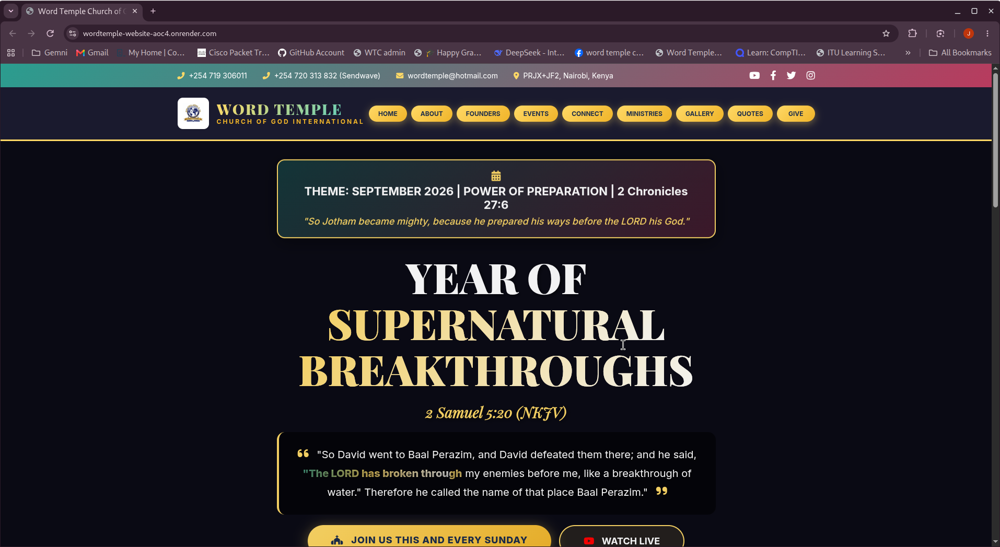
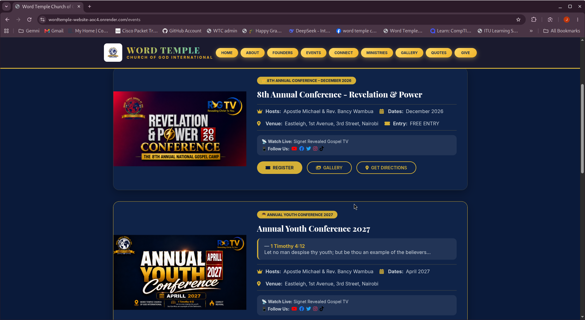
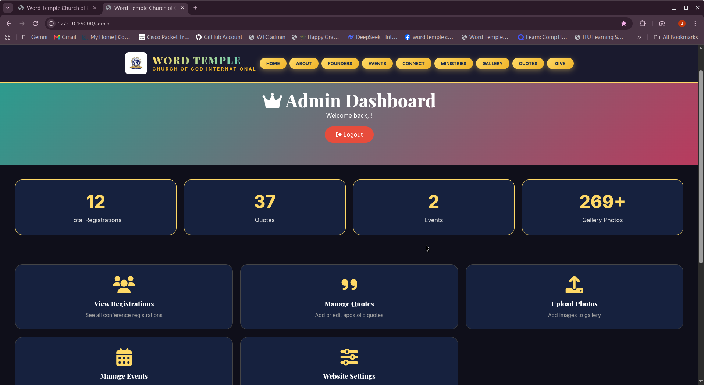
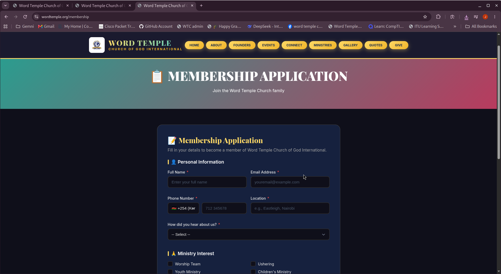

# 🏛️ Word Temple Church of God International

A dynamic, full-stack church website built with **Flask**, **JavaScript**, and **Google Sheets integration** — featuring a custom CMS, cinematic animations, and a modern UI/UX design.

## 🌐 Live Demo
**[https://wordtemple-website-aoc4.onrender.com/](https://wordtemple-website-aoc4.onrender.com/)**

---

## 📸 Screenshots

### Homepage


### Events Page


### Admin Dashboard


### Membership Form


---

## ✨ Features

### 🎨 Frontend
- **Cinematic Hero Section** with alternating background videos and Typed.js text animations
- **Responsive Design** — Optimized for mobile, tablet, and desktop
- **AOS (Animate on Scroll)** animations for smooth reveal effects
- **Water-flow text animation** for highlighted scripture
- **Dynamic event display** from JSON data
- **Multi-language phone support** with 40+ country codes
- **Dark mode design** with custom color palette

### ⚙️ Admin Dashboard
- **Event Management** — Add, edit, and delete events
- **Quote Management** — Add apostolic quotes
- **Registration Viewer** — See all conference registrations
- **Website Settings** — Change theme, scriptures, and service times
- **Gallery Upload** — Manage church photos
- **Auto-delete past events** — Keeps events page current

### 📊 Data Integration
- **Google Sheets Integration** for:
  - Conference registrations
  - Membership applications
  - Automated email confirmations
- **JSON-based data storage** for events, quotes, and settings
- **Automated Git push** workflow for content updates

---

## 🎨 UI/UX Design

### UI Skills Demonstrated

| Skill | Implementation |
|-------|---------------|
| **Color Palette Design** | Gold (#FFD966), Maroon (#B83B5E), Teal (#2A9D8F), Navy (#0a1a3a) |
| **Typography Pairing** | Playfair Display (headings) + Inter (body) |
| **Visual Hierarchy** | Theme badge → Heading → Scripture → Verse → Buttons |
| **Component Design** | Event cards, Ministry cards, Quote cards, Service cards |
| **Gradient Design** | Gold gradient buttons, dark gradient backgrounds |
| **Icon Usage** | Font Awesome icons used consistently |
| **White Space** | Proper padding, margins, and gap spacing |
| **Dark Mode Design** | Full dark theme with proper contrast ratios |

### UX Skills Demonstrated

| Skill | Implementation |
|-------|---------------|
| **Navigation Design** | Sticky navbar, mobile hamburger menu, clear active states |
| **Information Architecture** | HOME, ABOUT, FOUNDERS, EVENTS, CONNECT, MINISTRIES, GALLERY, QUOTES, GIVE |
| **User Flows** | Registration → Google Sheets → Email → Success message |
| **Form Design** | Multi-step forms, radio buttons, dropdowns, country codes |
| **Feedback Systems** | Success popups, loading states, hover effects |
| **Accessibility** | Alt text, aria-labels, keyboard-navigable |
| **Mobile Responsiveness** | Media queries, flexbox/grid, mobile-first approach |
| **Error Handling** | Form validation, user-friendly error messages |

---

## 🛠️ Tech Stack

| Layer | Technology |
|-------|-----------|
| **Backend** | Python, Flask |
| **Templating** | Jinja2 |
| **Frontend** | HTML5, CSS3, JavaScript |
| **Animations** | Typed.js, AOS |
| **Data** | JSON, Google Sheets |
| **Version Control** | Git, GitHub |
| **Deployment** | Render |
| **Email** | Google Apps Script |


## 📁 Project Structure
wordtemple-website/
├── app.py # Main Flask application
├── admin.py # Admin functions
├── data/ # JSON data files
│ ├── events.json
│ ├── quotes.json
│ ├── registrations.json
│ └── settings.json
├── static/
│ ├── css/
│ ├── js/
│ ├── images/
│ └── videos/
├── templates/ # Jinja2 templates
│ ├── base.html
│ ├── index.html
│ ├── events.html
│ ├── membership.html
│ └── admin_*.html
├── screenshots/ # Portfolio screenshots
└── requirements.txt


## 🚀 Getting Started

```bash
# Clone the repository
git clone https://github.com/janetakinyi/wordtemple-website.git
cd wordtemple-website

# Create virtual environment
python3 -m venv venv
source venv/bin/activate

# Install dependencies
pip install -r requirements.txt

# Run the application
python app.py
